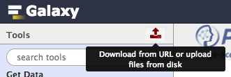
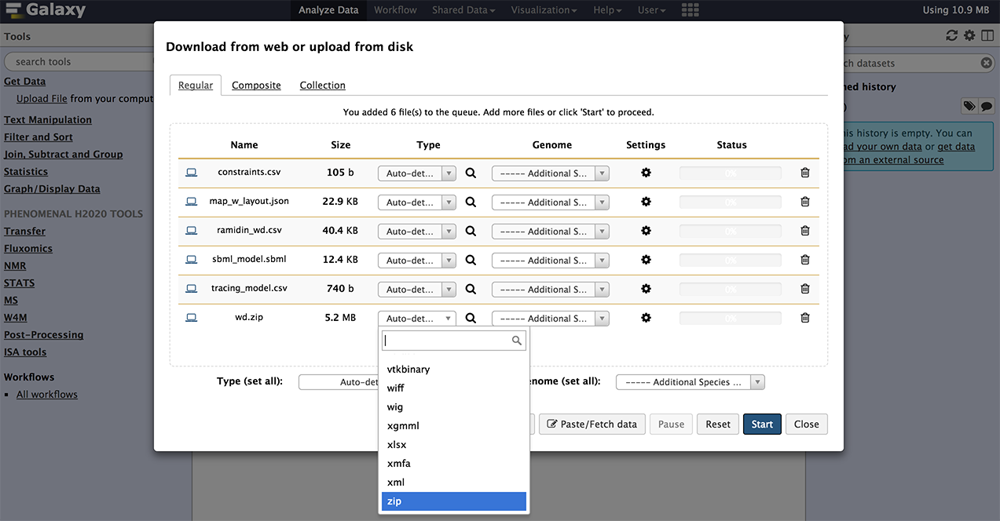

# Load the example data

Before we can run a workflow we need input data. For the Fluxomics workflow we need the following [collection of files](https://drive.google.com/open?id=0B7S2ZMhdzWwbcmp3YUI0eEliM0E) as input:

1. ramid - exchange file: **ramidin_wd.csv**, contains the values of isototopolog abundances, signal intensities, additional descriptors, and names of corresponding netCDF files, written by a mass spectrometer.
2. ramid - data files (.zip): **wd.zip**, zip file containing the CDF files with raw data used by ramid to evaluate mas spectra of the metabolites of interest.
3. iso2flux - tracing model: **tracing_model.csv**, with the propagation rules accounting for the transitions in carbon positions, between substrates and products, including also the correspondence between model metabolites and the measured isotopologues
4. iso2flux - SBML file: **sbml_model.sbml**, a sbml description of the model with all metabolites involved and the reaction steps included with their corresponding stoichiometry
5. iso2flux - contraints settings: **constraints.csv**, a file accounting for reaction fluxes, with fixed upper and lower bounds. 
6. escher-fluxomics - visualisation layout settings: **map\_w\_layout.json**, a file with the visualization layout settings for scheme generation"

[Download this archive](https://drive.google.com/uc?export=download&id=0B7S2ZMhdzWwbcmp3YUI0eEliM0E) and extract it on your local PC or laptop.

Next is to make the data available in Galaxy. This can be done in serveral ways, for this tutorial we will be using the **build-in file uploader** of Galaxy. The file uploader is available on the left of your screen, right under "Galaxy", to the right of "Tools". 

Click on the upload button shown to open the pop-up shown below. Either use the "Choose local file" option at the bottom of the pop-up, or drag and drop the files listed above from the archive (.zip) to upload the data. When done correctly, you should see the files listed as shown below.

Before we click on start to start the upload we need to change the "Type" of the data file "**wd.zip**" to zip. This will prevent Galaxy from extracting the files from the archive after uploading. After changing the type to "zip" we can click on start to initiate the upload.

When all files have been uploaded they will show up marked in green, and the status will be 100%. We can now use the "close" link in the bottom right to go back to the Galaxy main page. Here we will see a history in the right pane of the screen with all the uploaded files.

Now go back to the main [tutorial page](README.md) and follow on the next section. 
