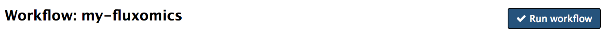
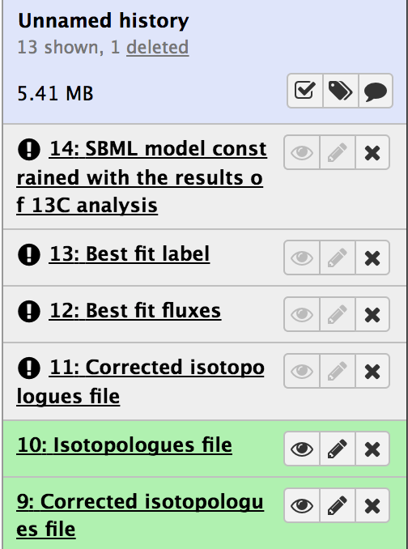
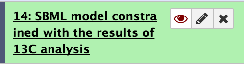

# Building a workflow with the fluxomics tools

You should be logged in into an instance where you had previously uploaded the sample data.

## 2.3.1 Create a new workflow

To start, we will create a new empty workflow. Do this by going to the blue menu bar on the top and press on `Workflows`.

On the next screen press `Create new workflow`, on the right side of the screen.

Name the workflow `my-fluxomics` and press `Create`

You should now be on the workflow canvas window. Now we will select the different tools and add them to the canvas.

## 2.3.2 Add ramid and midcor to the workflow

Click on `Fluxomics` under PHENOMENAL H2020 TOOLS and then click on `ramid` and `midcor`. You should see boxes appearing on the workflow canvas in the middle. Drag and drop the boxes so that they don't overlap, leaving `midcor` after `ramid`.

 

As you might remember, we run `ramid` and `midcor` separately before, and we fed the output of `ramid` into `midcor`. We will now mimick this by connecting the only output of `ramid` to `midcor`. Drag the circle with a triangle to the right of the ramid output (`outputExchange`) into the same icon available to the left of the only input of `midcor`. It should look like:

## 2.3.3 Add iso2flux to the workflow

Now, again under Fluxomics, click on `iso2flux`, to see that box appear on the canvas. Connect the only output of `midcor` to `iso2flux` input named `tracing_data`. It should look like this:

Now your workflow is ready for running, but you need to save it first. Go to the cog icon to the upper right of the window, click on it and select `Save`.

## 2.3.4 Run the workflow with data

To run it with data, press the cog icon again and select `Run` this time.

Now we need to pair the different input data files in our history to the workflow inputs. The final result with all assignments should look like this:

**Please make sure that all your inputs are paired to the workflow inputs as shown, otherwise the execution will fail.** 

Once this is ready, press the **Run workflow** button.

## 2.3.5 Running workflow

As you trigger the execution of the workflow, you will see the creation of files, initially in grey to turn into green as they are ready.

Once the wokflow is ready and all files are available, click on the eye icon next to the `SBML Constrained with the results of 13C analysis`, to see the SBML file with constraints on the fluxes.

We will now run a previously stored version of this workflow, which will include an additional final visualization module that will enable us to see the results of fluxes on top of a metabolic network. Once all your results are in green, please proceed to the [main tutorial page](README.md) to continue with part 2.4.
