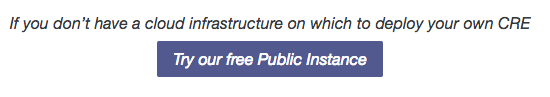
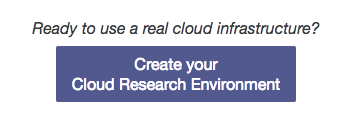
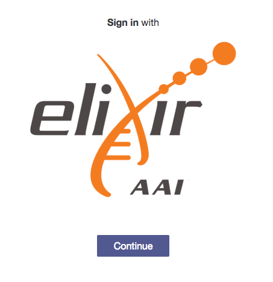
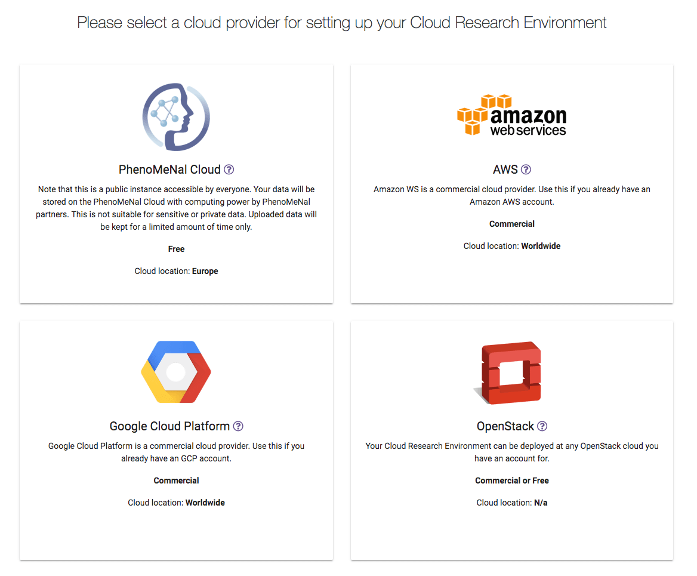
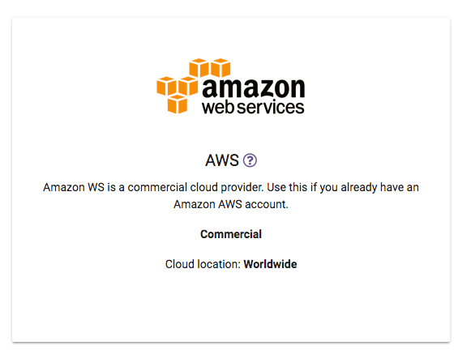
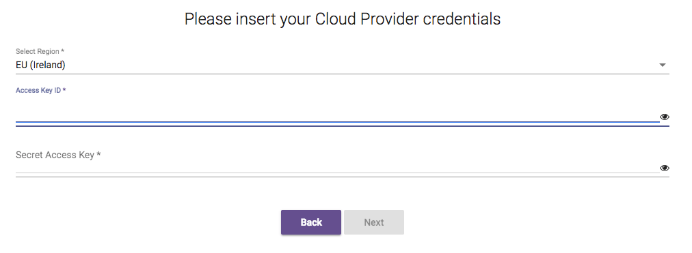
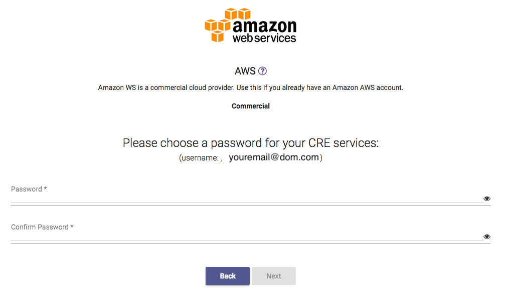
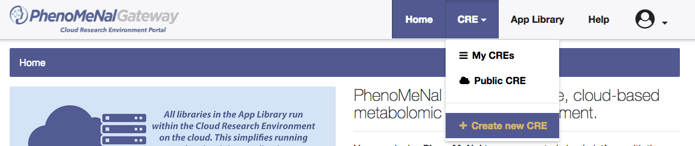

# Portal practical

Prepared by Sijin He and Pablo Moreno

## Overview

1.- Access the Phenomenal Portal on https://portal.phenomenal-h2020.eu/.

2.- The PhenoMeNal Portal consists on three main parts, displayed in this order in the main page:

 - Cloud Research Environment Deployment
 - App Library
 - Documentation

3.- On the left click on "Try our free Public Instance" button, it will take you to the PhenoMeNal Public Galaxy instance.

4.- Go back to the Portal tab on your browser.

## Login and Cloud deployment

5.- Now, to the right, click on "Create Cloud Research Environment" blue button. This will take you to the login page, where our single sign on (SSO) will allow you to register with Google, LinkedIn, Orcid or your academic account (provided is recognised by Elixir).

6.- On the login page, click on the "Continue" button under the Elixir AAI logo.

6.1.- It will ask you to choose an identity provider, choose one and proceed to authenticate with it.

6.2.- The first time it will ask you to register with Elixir, follow this registration process if that is the case. After that, you might need to open again the Portal URL https://portal.phenomenal-h2020.eu/ and click on "Create Cloud Research Environment" if you had to go through the Elixir registration. This only happens when registering.

6.3.- Alternatively, if already registered with Elixir, you might see a request of permission from Elixir to pass on certain data from you to PhenoMeNal/EMBL-EBI. Press "Yes, continue".

7.- Once you login, you should see the ELSI requirements and Terms & Conditions, which can be viewed by clicking the links. Then, you will need to agree with the Terms & Conditions as well as with the ELSI requirements for the Portal before you can continue. Click on "I Agree".

8.- You will now be able to select from the available cloud providers to run a deployment. You will only be able to do this if you have an account with credits on Amazon AWS or Google GCE cloud services currently.

9.- **Optional** - Deployment with AWS:

9.1.- If you have AWS credentials, as the demonstrator, click on "Select" on the Amazon AWS box.

9.2.- Select a Region, paste your Access Key and your Secret Access Key. Then press "Next".

9.3.- In order to secure your Galaxy instance, the system requires that you set an email and password (and confirm it). This will be used as well for your Jupyter and Kubernetes Dashboard credentials. Please add now an email and password (and confirm it) in the fields. Please don't use any sensitive passwords. Then press "Next", and confirm in the following part pressing "Deploy". The deployment will start.

9.4.- The deployment has started and it should take in the region of 20 minutes.

After a short while, it should change to display the progress as well as the Logs access.

9.5.- Optional point: if you really want to see what is going behind the scenes, and get all the Infrastructure-as-code logs, press "Logs" on the progressing AWS card shown above, and enjoy your logs! Warning: you might see some tasks saying failed and retrying, this is part of the natural process of the deployment waiting for certain things to be ready.

Skip to point 10 for the Public instance, or to point 14 for the App Library, then come back here.

9.6.- Later on (around 20 minutes), check whether the deployment is ready on the Portal's deployment page. If it says "RUNNING" in green, you will be able to click on the "Galaxy" icon under CRE Services, which will take you to the deployed CRE Galaxy frontend. On that instance, you should be able to login with the pre-set email and password (point 9.3 above).

9.7.- You can now try one of the PhenoMeNal workflow tutorials available at https://portal.phenomenal-h2020.eu/help under "User tutorials", or play with individual tools.

9.8.- To destroy your instance, go to https://portal.phenomenal-h2020.eu/cloud-research-environment (or click on the CRE drop down menu and choose "My CREs"), locate the card for the deployment that you are after and then click "Stop" at the bottom of the card. Please make sure that the instance has been destroyed in AWS later on, specially if there are errors.

## Public instance account

10.- Open a new PhenoMeNal portal tab https://portal.phenomenal-h2020.eu/, click on CRE at the top menu, and then select "Create new CRE".

11.- You will have a choice of using the PhenoMeNal Cloud and other clouds, click on the PhenoMeNal Cloud card.

Press "Register"

and you will be prompted to add a password and confirm it, then press "Next":

You will be notified that the account has been created successfully and a "Login" button will become available. Please note the email used for registering (it appears on the screen).

12.- Press "Login", it should take you to the Galaxy Public instance login page, where you should use the same email and password from the last part.

13.- You can now try one of the PhenoMeNal workflow tutorials available at https://portal.phenomenal-h2020.eu/help under "User tutorials", or play with individual tools.

## App Library

14.- Open a new PhenoMeNal portal tab https://portal.phenomenal-h2020.eu/, and click on App Library at the top.

15.- App library is a catalogue of containerised tools.

16.- On the left hand side, there is a filter which helps users to filter applications according to the characteristics of the applications, such as functionality, approaches, and instrument data types. For example, we can select MS, which will show a list of applications that are related to MS.

17.- Select only NMR on the filter, which shows a list of applications that contains MS or NMR. When we click rnmr, we will see all information relating to this application, including, website, version, git repo, features, description, screenshots of the application, installation, usage instruction, and publication.

18.- Besides using filters, we can also use text-based search to look for a specific application, for example, we can look for metabolights labs uploader, by typing in “metabolights”, we are able to find the application. When we click the logo of the application, users will be redirected to a page of the application.

## Help

19.- Open a new PhenoMeNal portal tab https://portal.phenomenal-h2020.eu/ (or use an existing one), and click on Help at the top.

20.- At the top of the help page, there is a search bar which allows users to search for documentation.

21.- For example, we can search for "Galaxy". Choose the first result, take a look.

22.- Additionally, topics are organized under three major sets: User Documentation, Developer Documentation and User Tutorials. The last one focuses on workflows to be run inside the CRE.
