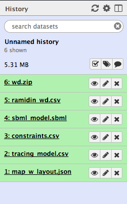
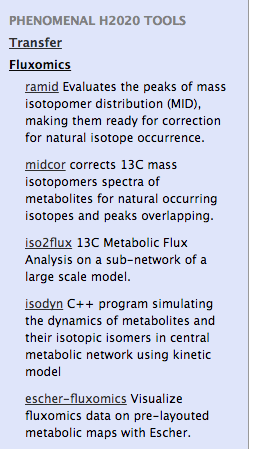
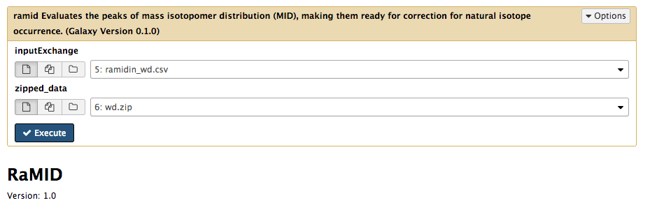
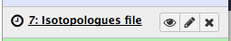
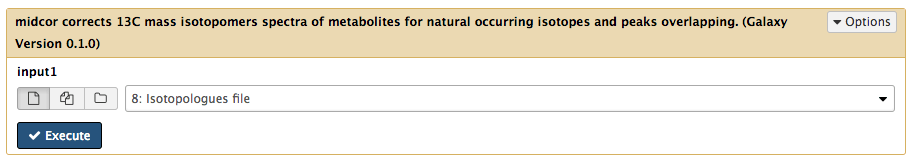

# Run tools individually with data

Previous to setting up and running a workflow, we will run some of the tools manually with the data we have loaded.

## 2.2.1 Go to Analyze Data mode

You should have just uploaded data as per the previous part of the tutorial. Make sure that you are on the "Analyze Data" mode in Galaxy by pressing "Analyze Data" on the top dark blue menu.

You should still be able to see the recently uploaded files in your History, to the right of the window:

Click on Fluxomics under PHENOMENAL H2020 TOOLS on the left hand side menu.

You should see the list of Fluxomics tools open.

## 2.2.2 Run ramid

Click on ramid. It should display on the center frame now the setup for that tool.

Now we need to pair inputs that we uploaded to the inputs of the ramid tool. Ramid will pick a zip file which contains NetCDF files and preprocess them to obtain peaks of isotopmer distribution, according to metadata provided in the `inputExchange` file. Make sure then that `inputExchange` is set to the file `ramidin_wd.csv` as shown in the previous screenshot. Make sure that `zipped_data` is set to `wd.zip` file, as in the previous screenshot. The numbers that the files have before their names is irrelevant, and only denotes their position in your history. This is how you pair input data files to a tool in Galaxy in general. When you have checked the assignments, press the blue **Execute** button. You should see the new file popping in grey in your history.

Once the job is done, the file icon will turn green. 

Then you can see the contents of the file by pressing on the eye icon to the right of the file name. We can now execute the following tool, midcor, which will correct the isotopologues obtained from the MS data by ramid.

## 2.2.3 Run midcor

Click again on the Fluxomics title under PHENOMENAL H2020 TOOLS. Click now on `midcor`, which will show again the dashboard for that tool. Now we need to pair the previous tools output with midcor. For that, make sure that the field `input1` is paired to `Isotopologues file` as in the screenshot below. Then press **Execute**.

You should see the `Corrected isotopologues file` appear first grey and then turn to green, signalling is ready.

This illustrates how two tools are called in tandem. Now we will proceed to actually build a workflow with these tools and some others. Please got back now to the [main tutorial page](README.md) and go to the next step, point 2.3.

